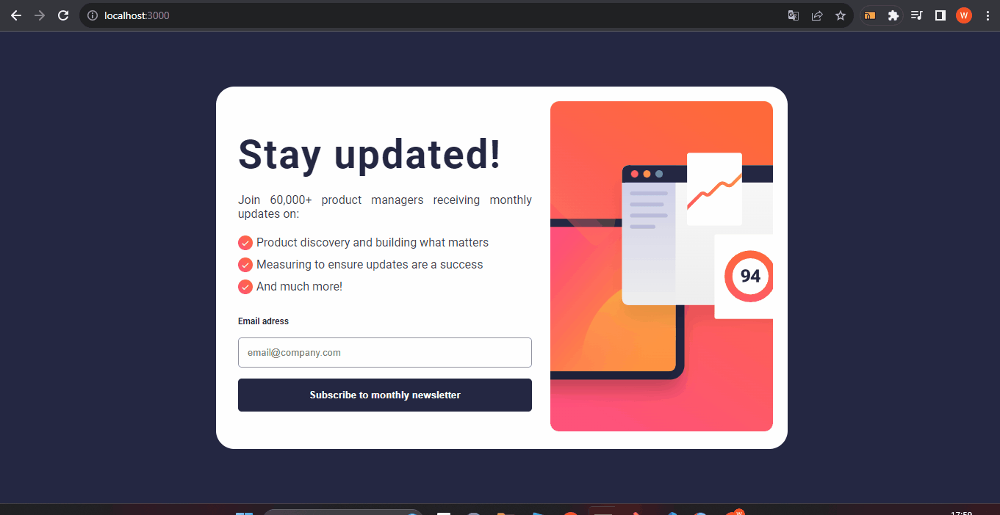

# Frontend Mentor | Newsletter sign-up form with success message

Projeto do front end mentor, utilizados para fins didáticos e de prática.

## Ferramentas 🛠️
- React utilizando Vite;
- Styled-components;
- React-router-dom
- framer-motion

## Aprendizados 🤓

- Validação do input
    - o projeto conta com um input que precisa ser validado, e caso o formato de e-mail não estaja de acordo, um mensagem de erro precisa ser exibida.
    Fiz a validação utilizando o useState, apesar de ter pesquisado e haver outras formas, por ser apenas um input optei pela state.
 

- Animações
    - Nunca tinha utlizado o framer motion, e resolvi testar ele nesse projeta, para animar a transição das rotas

 

- [@vitejs/plugin-react](https://github.com/vitejs/vite-plugin-react/blob/main/packages/plugin-react/README.md) uses [Babel](https://babeljs.io/) for Fast Refresh
- [@vitejs/plugin-react-swc](https://github.com/vitejs/vite-plugin-react-swc) uses [SWC](https://swc.rs/) for Fast Refresh
